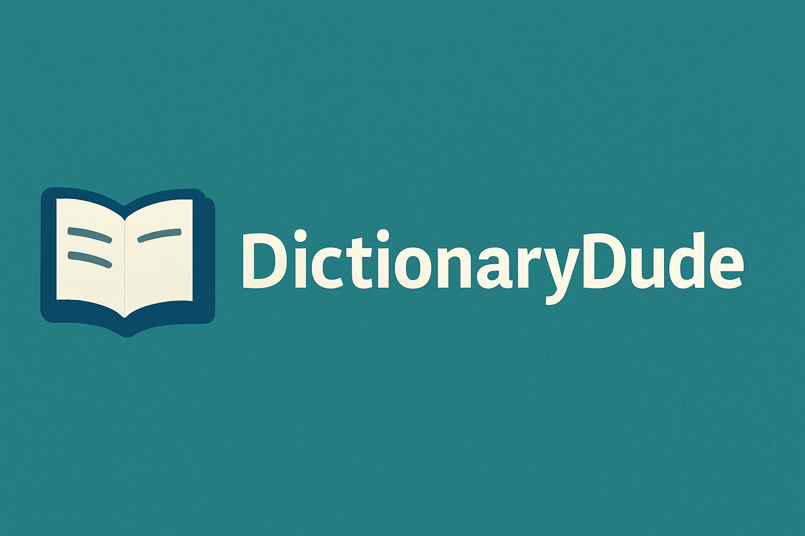

<p align="center">
  
</p>


# 📚 DictionaryDude

[](https://www.python.org/)
[](https://discordpy.readthedocs.io/)
[](LICENSE)

DictionaryDude is a simple yet powerful **Discord bot** that lets you instantly look up word definitions, synonyms, and pronunciations using the Merriam-Webster API.  

---

## ✨ Features
- ✅ Fetch definitions instantly with `?define word`
- ✅ Find synonyms and related words
- ✅ Listen to pronunciations
- ✅ Clean, easy-to-use Discord commands

## ⚙️ Installation

1. Clone the repo:
   ```bash
   git clone https://github.com/bannedb/dictionarydude.git
   cd dictionarydude
   
2. Install dependencies
   ```bash
   pip install -r requirements.txt

4. Add your Discord Bot Token and Merriam-Webster API Key to a .env file:
   ```bash
   DISCORD_TOKEN=your_discord_token_here
   MW_API_KEY=your_api_key_here


5. Run the bot by typing in 'python bot.py' into the console and enjoy!
